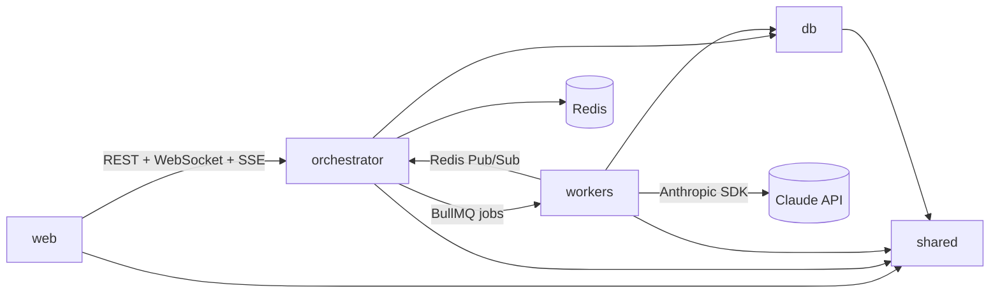

# Codebase Map

Generated: 2026-04-07 | Status: **Planning phase — no source code exists yet**

## Planned Module Boundaries

| Module | Directory | Public API | Dependencies | Domain |
|--------|-----------|------------|--------------|--------|
| web | apps/web/ | Pages, components | shared, orchestrator API | PO Interface / PWA |
| orchestrator | apps/orchestrator/ | Session start/stop, decision handler, SSE stream | shared, db, redis, workers (via BullMQ) | Session & Flow Control |
| workers | apps/workers/ | Agent job handlers (BA, Stakeholder, ...) | shared, db, anthropic SDK | AI Agent Runtimes |
| shared | packages/shared/ | TypeScript types, Zod schemas, scoring engine | none | Shared Types & Logic |
| db | packages/db/ | Drizzle schema, query helpers, migrations | PostgreSQL | Data Layer |

## Planned Dependency Graph



## Domain Ownership

| Domain | Modules | Key Planned Files |
|--------|---------|-------------------|
| PO Interface | web | apps/web/src/app/dashboard/, apps/web/src/components/chat/ |
| Session Management | orchestrator | apps/orchestrator/src/session-manager.ts, state-machine.ts |
| AI Agents | workers | apps/workers/src/agents/ba-agent.ts, stakeholder-agent.ts |
| Scenario Engine | orchestrator, shared | scenarios/*.yaml, packages/shared/scenario-parser.ts |
| Metrics & Scoring | shared, orchestrator | packages/shared/scoring-engine.ts, impact-model.ts |
| Data Persistence | db | packages/db/schema.ts, packages/db/migrations/ |

## Event Flow (planned)

```
PO action → WebSocket → Orchestrator → XState transition
                                     → BullMQ job → Agent Worker
                                                   → Anthropic API
                                                   → Redis Pub/Sub event
                                     ← State update → SSE push → Web UI
                                     → Scoring Engine → Metrics update
```
